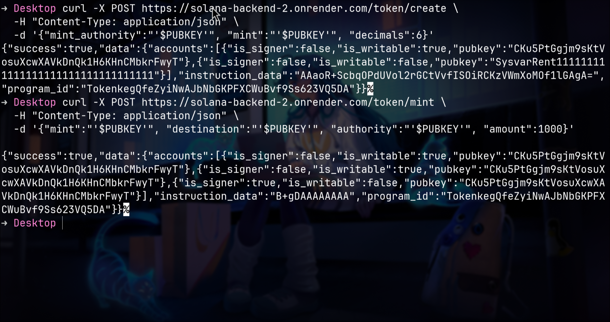

# Solana Instruction Builder API

A Rust-based backend API built using **Axum**, designed to generate raw Solana instructions for use in Solana applications.

It includes routes for:
- Keypair generation
- Token creation & minting
- SOL and SPL transfers
- Message signing and verification

---

##  Features

-  Generate Solana keypairs
-  Create and mint SPL tokens
-  Build raw instructions for token and SOL transfers
-  Sign and verify messages with Solana keypairs

---

##  Folder Structure
├── src/
│ ├── main.rs # Entry point, sets up Axum server and routes
│ ├── routes/
│ │ ├── keypair.rs # /keypair route logic
│ │ ├── token.rs # /token/create and /token/mint logic
│ │ ├── message.rs # /message/sign and /message/verify logic
│ │ ├── send.rs # /send/sol and /send/token logic
│ └── utils/
│ └── response.rs # Common success/error response helpers
├── .env # Environment variables (optional)
├── Cargo.toml # Rust dependencies and package info
└── README.md # This file

---

## ⚙️ Getting Started

### 1. Clone the repository

```bash
git clone https://github.com/your-username/fellowship.git
cd fellowship

API Endpoints
Endpoint	Method	Description
/keypair	POST	Generate a new Solana keypair
/token/create	POST	Create a new SPL token
/token/mint	POST	Mint tokens to a destination
/message/sign	POST	Sign a message with a secret key
/message/verify	POST	Verify a signed message
/send/sol	POST	Create a SOL transfer instruction
/send/token	POST	Create a SPL token transfer

## 🖼️ Sample Screenshots

### 🔐 Keypair Generation


### 🪙 Token Creation


### 🪙 Token Mint


### ✍️ Message Sign


### ✅ Message Verify


### 💸 Send SOL


### 🔁 Send Token

